# Pickle Rick
In this CTF challenge, I began by inspecting the source code of the index page. While going through the HTML file, I found a username hidden there, which I noted down. However, after a thorough search, I couldn't find anything else of interest on the webserver.

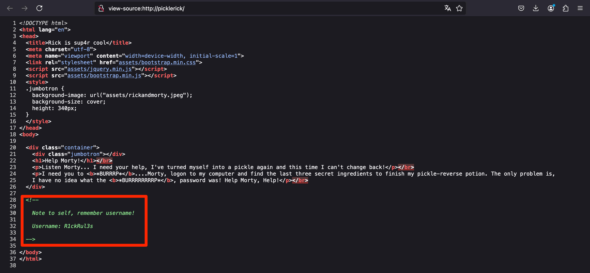

I ran an Nmap scan on the target. The scan revealed that ports 22 (SSH) and 80 (HTTP) were open. Unfortunately, I couldn’t gather much from either service at that point, so I proceeded with a bruteforce directory and file discovery using Gobuster.

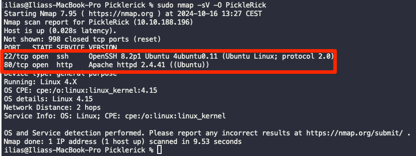

Running Gobuster yielded four interesting results:

- /assets directory: This contained a few files, but none of them were useful.
- /robots.txt: This contained a text string, which I saved for later.
- /login.php: Led to a login page.
- /portal.php: Also led to the same login page as /login.php.

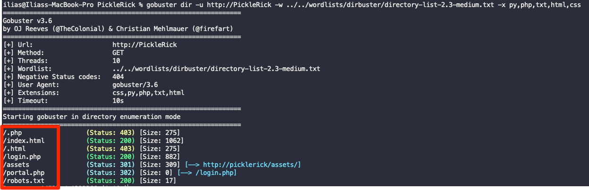

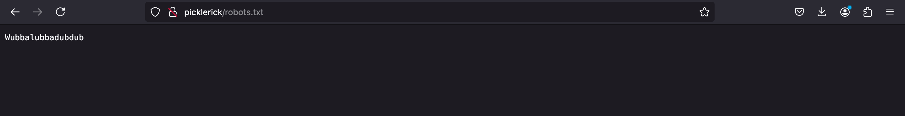

On the login page, I tried using the username I found in the source code earlier, and for the password, I used the text from robots.txt. This allowed me to log in successfully and granted me access to a command panel.

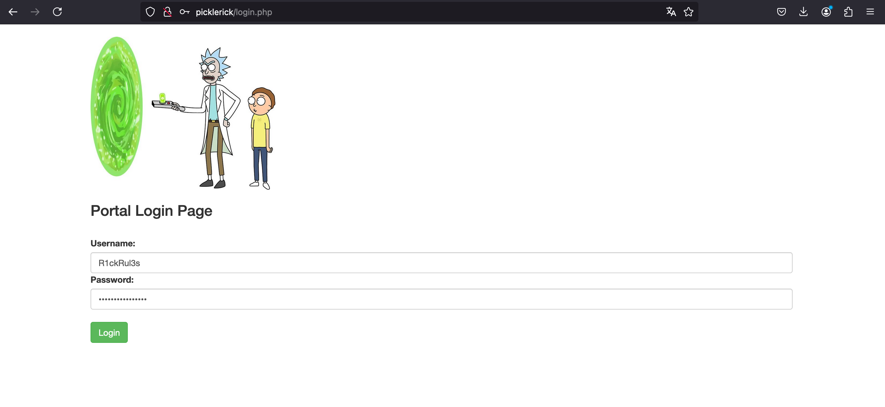

Once on the command panel, I executed the command "ls" to list the contents of the current directory. I noticed a file named Sup3rS3cretPickl3Ingred.txt. Naturally, I tried to read the file using cat, but it failed with a “command disabled” error.

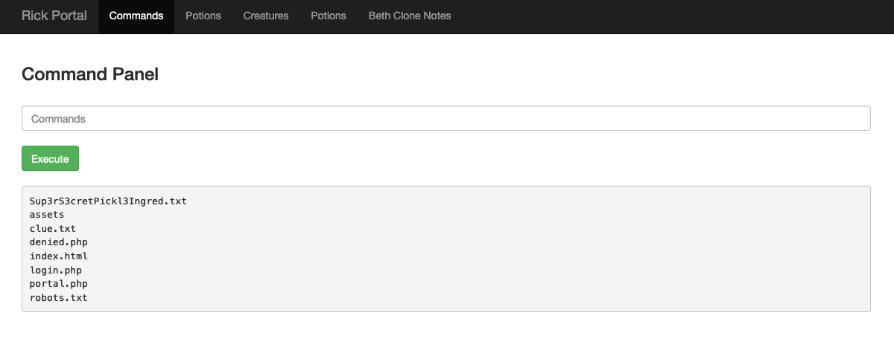

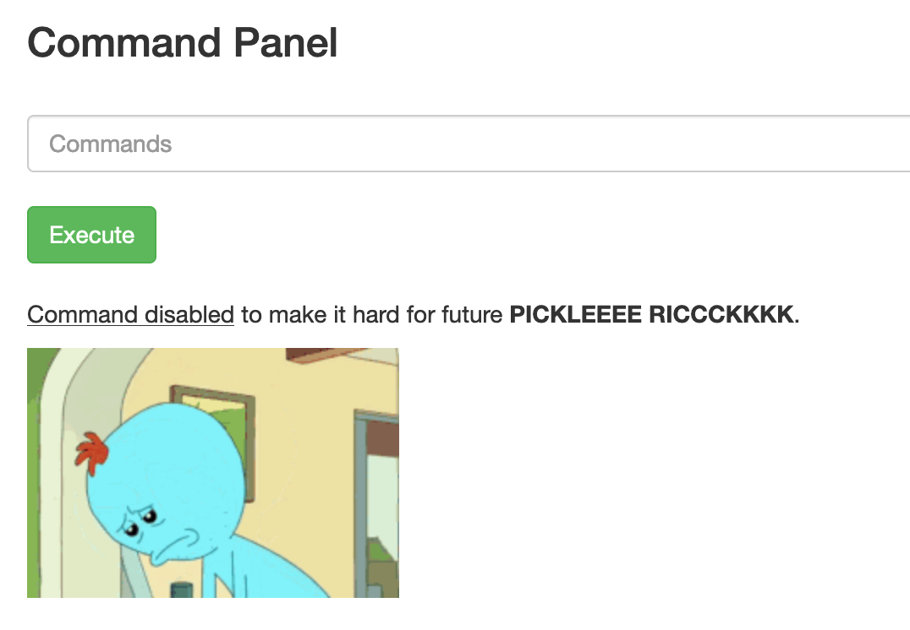

Next, I checked if Python was available on the system by running: **python3 -c 'print("hello world")'**. When I received the expected "hello world" output, I realized it was possible to use Python for a reverse shell.

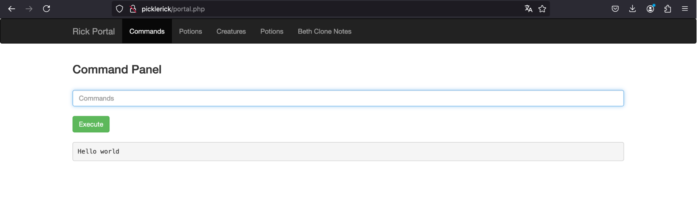

I used my cheat sheet to find a suitable Python one-liner for a reverse shell, which can be found [here.](/cheat-sheet/rev-shells/one-liners/) Before executing it, I set up a listener on my machine using netcat.

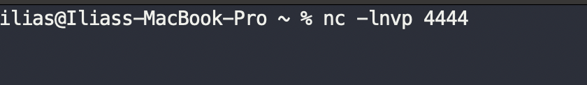

Then, I executed the Python one-liner on the command panel, which gave me a reverse shell on the target machine.

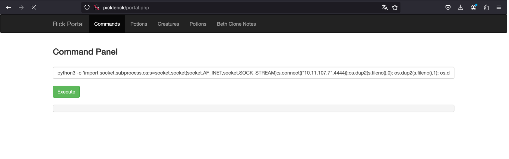

The initial reverse shell was quite unstable. To stabilize the shell, I followed the standard process for upgrading it, which involves using Python to spawn a fully interactive TTY shell. This ensures smoother command execution and interaction with the system. You can find more about shell stabilization [here.](/cheat-sheet/rev-shells/shell-Stabilizing/)

Once the shell was stabilized, I was able to easily read Sup3rS3cretPickl3Ingred.txt, finding the first ingredient. In the same directory, I discovered a clue.txt file that instructed me to "look around the file system for the other ingredient."

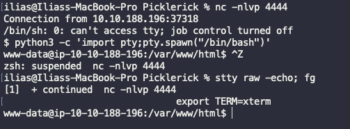

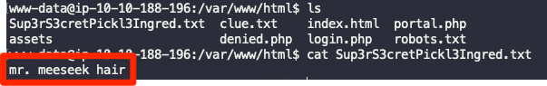

Following the clue, I navigated to the /home directory to check for other user folders. I found a user named rick, and after accessing his folder, I found the second ingredient.

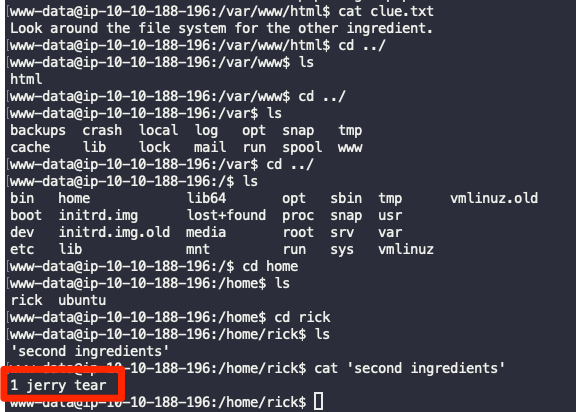

Now, I needed to perform privilege escalation to gain root access and find the final ingredient. I ran the following command to check my sudo privileges: **sudo -l**.
The output showed that the www-data user could run all commands as root without a password.
This means that the www-data user has full sudo privileges without needing to enter a password. With this configuration, I could simply run: **sudo su**, And become root.

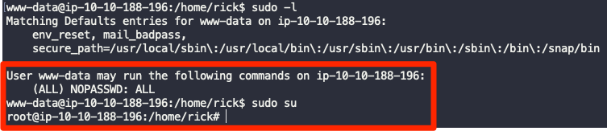

As root, I navigated to the /root directory, where I found the third and final ingredient needed to complete the challenge

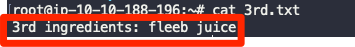

